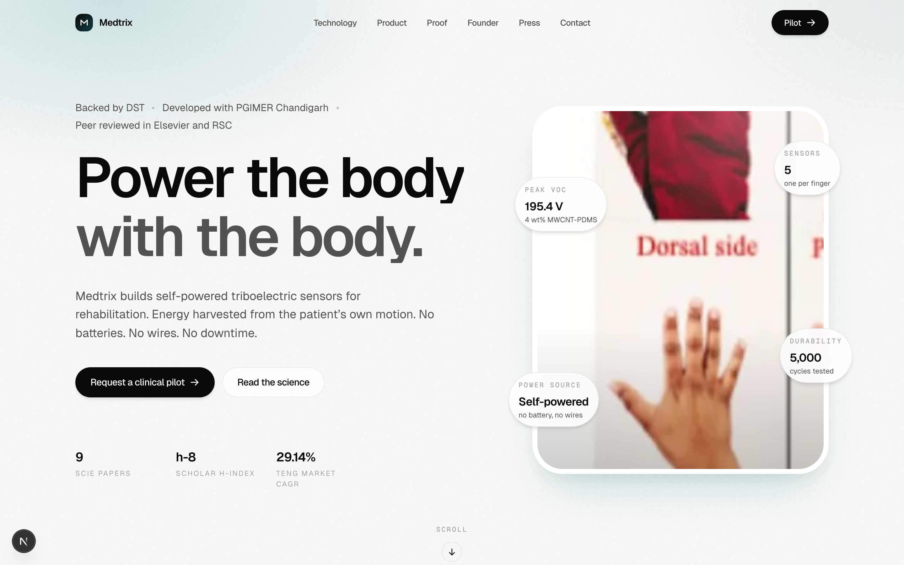

# Medtrix Technologies

Self-powered triboelectric sensors for rehabilitation. The landing page for **Medtrix Technologies Pvt. Ltd**, an Indian deep-tech startup founded by Dr. Akshpreet Kaur, building rehab-grade wearables that run on the patient's own motion.



> Power the body with the body. No batteries. No wires. No downtime.

---

## Overview

A single-page, scroll-led marketing site for Medtrix Technologies, engineered for Apple-tier smoothness and evidence-first content.

The product introduced on the site is the **Rehab Glove**, a five-sensor smart wearable triboelectric nanogenerator (SW-TENG) mounted on the dorsum of a fabric glove. Each sensor measures finger bend angle and grip strength in real time, with zero battery and zero wires.

All performance figures on the site are pulled verbatim from peer-reviewed publications. No marketing extrapolation, no synthetic claims.

---

## Stack

| Layer | Choice |
| --- | --- |
| Framework | Next.js 15 (App Router) |
| Runtime | React 18.3 |
| Styling | Tailwind CSS v3 (design tokens via `tailwind.config.ts`) |
| Motion | Framer Motion + Lenis smooth scroll |
| Fonts | Geist Sans + Geist Mono via `next/font/google` |
| Icons | Hand-rolled inline SVG primitives (zero icon-library bloat) |
| Utility | clsx + tailwind-merge |
| Deploy | Vercel |

---

## Local development

```bash
# install
npm install

# dev (HMR)
npm run dev

# production build
npm run build

# serve production locally
npm start
```

Default port is 3000. Open http://localhost:3000.

The dev server is light. If you run into RAM pressure on small machines, prefer `npm run build && npm start` for previewing without the compile loop.

---

## Project structure

```
web/
├── app/
│   ├── globals.css            design tokens, grain texture, Lenis CSS hooks
│   ├── layout.tsx             root layout, Geist fonts, Lenis provider, metadata
│   └── page.tsx               composes Nav + Hero + remaining sections
├── components/
│   ├── motion/
│   │   └── word-reveal.tsx    word-by-word fade with spring physics
│   ├── providers/
│   │   └── lenis-provider.tsx Lenis init with reduced-motion guard
│   ├── sections/
│   │   ├── nav.tsx            glass nav, scroll-aware blur, mobile sheet
│   │   ├── hero.tsx           asymmetric hero, glove visual, spec callouts
│   │   ├── section-placeholder.tsx
│   │   └── footer-mini.tsx    legal, socials, disclaimer
│   └── ui/
│       ├── button.tsx         spring-physics primary + secondary
│       ├── eyebrow.tsx        mono uppercase chip
│       └── icons.tsx          inline SVG icon primitives
├── lib/
│   ├── cn.ts                  clsx + tailwind-merge helper
│   └── motion.ts              shared spring presets and variants
├── public/
│   ├── glove/glove-hero.jpg   product photograph
│   └── preview-hero-1440.png  README hero image
├── next.config.ts             optimizePackageImports for framer-motion + lenis
├── postcss.config.mjs
└── tsconfig.json
```

---

## Underlying science

Two peer-reviewed Elsevier papers are the basis for every number on this site. Both are first-authored by Dr. Akshpreet Kaur.

| Paper | Journal | Year | DOI |
| --- | --- | --- | --- |
| Smart wearable triboelectric nanogenerator for self-powered bioelectronics and therapeutics | Microelectronic Engineering | 2023 | [10.1016/j.mee.2023.111992](https://doi.org/10.1016/j.mee.2023.111992) |
| Single electrode triboelectric nanogenerator integrated pacemaker lead for cardiac energy harvesting | Sensors and Actuators A: Physical | 2025 | [10.1016/j.sna.2025.116606](https://doi.org/10.1016/j.sna.2025.116606) |

Key public metrics (all sourced from the papers above):

- Peak open circuit voltage of the rehab glove SW-TENG: **195.4 V** at 4 wt% MWCNT-PDMS
- Triboelectric output gain over pure PDMS baseline: **~79 percent**
- Durability of the SE-TENG variant: **5,000 cycles** with negligible degradation
- Number of sensors per glove: **5**, one per finger
- Optimum nanocomposite weight ratio: **4 wt% MWCNT** in PDMS

---

## Founder

**Dr. Akshpreet Kaur** is the founder and director of Medtrix Technologies. She holds a PhD from UIET, Panjab University, where her thesis "Fabrication of Energy Harvester for Biomedical Applications" was co-supervised with the Department of Cardiology at PGIMER Chandigarh. She is a Visvesvaraya Postdoctoral Fellow of the Department of Science and Technology, Government of India.

Her work has been recognised by the Government of India (First Prize, India International Science Festival, 2022), the University of Oxford (Inaugural Annual Podium Institute Conference, 2024), and the University of Cambridge (Wearable Innovation Forum, 2025).

Verified credentials:
- Google Scholar: https://scholar.google.com/citations?user=dQqEg0EAAAAJ&hl=en
- ORCID: https://orcid.org/0000-0003-3252-7635
- LinkedIn: https://www.linkedin.com/in/akshpreetkaur93/

---

## Status

Research-grade prototype. Not a medical device under any regulatory framework as of this date. All clinical pilot, partnership, and investor inquiries are routed through the Contact section of the live site.

---

## License

All rights reserved. © 2026 Medtrix Technologies Pvt. Ltd.
